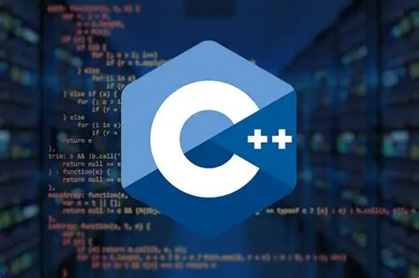

# Заголовок 1
## Заголовок 2
### Заголовок 3

---

Заголовок 1
=

Заголовок 2
-

1. пункт списка
    * пункт списка
    + пункт списка
    - пункт списка
2. пункт списка
3. пункт списка

***

Перенос строки.  
БАМ БАМ.  
**Жирный текст**  
*Курсивный текст*
***Курсивный и жирный***


```
блок кода   
бла  
бла  
```

>Цитата

[Текст](https://github.com/seregameiran)



#### Картинка с ссылкой
[]{https://github.com/seregameiran}

item  | Value | Че-то
:---- | :---: | ----:
Comp  | 2000  | 1
Phone | 1600  | 2


